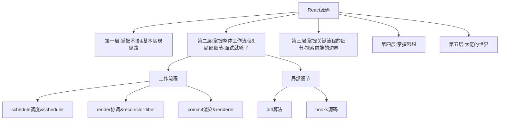

## React导学

### React源码学习层次

```mermaid
 graph TB;
React源码-->第一层:掌握术语&基本实现思路
React源码-->第二层:掌握整体工作流程&局部细节-面试就够了
React源码-->第三层:掌握关键流程的细节-探索前端的边界
React源码-->第四层:掌握思想
React源码-->第五层:大佬的世界
第二层:掌握整体工作流程&局部细节-面试就够了-->工作流程
第二层:掌握整体工作流程&局部细节-面试就够了-->局部细节
工作流程-->schedule调度&scheduler
工作流程-->render协调&reconciler-fiber
工作流程-->commit渲染&renderer
局部细节-->diff算法
局部细节-->hooks源码
```

### React Hooks

