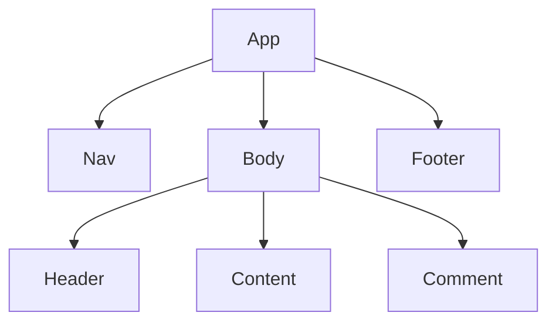

[React性能优化](#1)
  - [为什么React需要性能优化API?](#2)
  - [React性能优化应该遵循的法则](#3)
    + [抽离Demo1](#4)
    + [抽离Demo2](#5)
  - [性能优化背后的源码运行机制](#6)
    + [该如何比较props?](#7)

<p id=1></p>

## React性能优化

<p id=2></p>

### 为什么React需要性能优化API?

React中什么情况组件会重新渲染呢？
1. 组件自己的state变化
2. 父组件传递的props变化
3. 父组件重新渲染


如图我们创建了一个React组件根组件APP和他下面的子组件，当我们更新Comment组件的时候，React会从APP组件开始重新创建树，这样就导致了性能的低。我们需要在重新创建树的时候跳过没有更新的组件。

<p id=3></p>

### React性能优化应该遵循的法则

**优化的原则就是将变于不变的部分分离，变的部分有三种，`props`、`state`、`context`。**
**当父组件满足性能优化条件，子组件才能可能命中性能优化。**

<p id=4></p>

#### 抽离Demo1
```js
function App(){
  console.log('Apps');
  const [num,setNum] = useState(1);
  function set(){
    setNum(num+1)//当父组件里面的数据改变，则每次都要加载子组件
  }
  return <div>
    <div>{num}</div>
    <button onClick={set}>+</button>
    <Body />
  </div>
}

function Body(){
  console.log('Body');
  return <div>222</div>
}
```
我们可以将上述组件的变于不变的部分抽离
```js
function App(){
  console.log('Apps');
  return <div>
    <Btn />
    <Body />
  </div>
}

function Btn(){
  console.log('Btn');
  const [num,setNum] = useState(1);
  function set(){
    setNum(num+1)
  }
  return (
    <div>
      <div>{num}</div>
      <button onClick={set}>+</button>
    </div>
  )
}

function Body(){
  console.log('Body');
  return <div>222</div>
}
```

<p id=5></p>

#### 抽离Demo2
```js
function App(){
  console.log('Apps');
  console.log('Btn');
  const [num,setNum] = useState(1);
  function set(){
    setNum(num+1)
  }
  return <div title={num}>
    <div>{num}</div>
    <button onClick={set}>+</button>
    <Body />
  </div>
}

function Body(){
  console.log('Body');
  return <div>222</div>
}
```
抽离变与不变的部分。
```js
function App(){
  console.log('Apps');
  return <Btn>
    <Body />
  </Btn>
}

function Btn({children}){
  console.log('Btn');
  const [num,setNum] = useState(1);
  function set(){
    setNum(num+1)
  }
  return <div title={num}>
    <div>{num}</div>
    <button onClick={set}>+</button>
    {children}
</div>
}

function Body(){
  console.log('Body');
  return <div>222</div>
}
```
将APP组件中变的部分于不变的部分分离开来，这样变的部分就不会影响到不变的部分了。

<p id=6></p>

### 性能优化背后的源码运行机制

<p id=7></p>

#### 该如何比较props?
1. 全等比较--高效，但不易命中。
2. 浅比较--不高效，但易命中。
React中旧新props的比较，默认是全等比较，所以当props没有传值的时候，是比较的两个空对象，这样比较还是显示为false，组件props改变。我们可以通过memo将全等比较改变成浅比较。

memo
```js
function App(){
  console.log('Apps');
  const [num,setNum] = useState(1);
  function set(){
    setNum(num+1)
  }
  return <div>
    <div>{num}</div>
    <button onClick={set}>+</button>
    <Body />
  </div>
}

const Body = React.memo(()=>{
  console.log('Body');
  return <div>222</div>
})
```
useMemo
```js
function App(){
  console.log('Apps');
  const [num,setNum] = useState(1);
  function set(){
    setNum(num+1)
  }
  return <div>
    <div>{num}</div>
    <button onClick={set}>+</button>
    <Middle />
  </div>
}

function Middle(){
  return useMemo(()=>{
    return (
      <Body />
    )
  },[])
}

const Body = React.memo(()=>{
  console.log('Body');
  return <div>222</div>
})
```