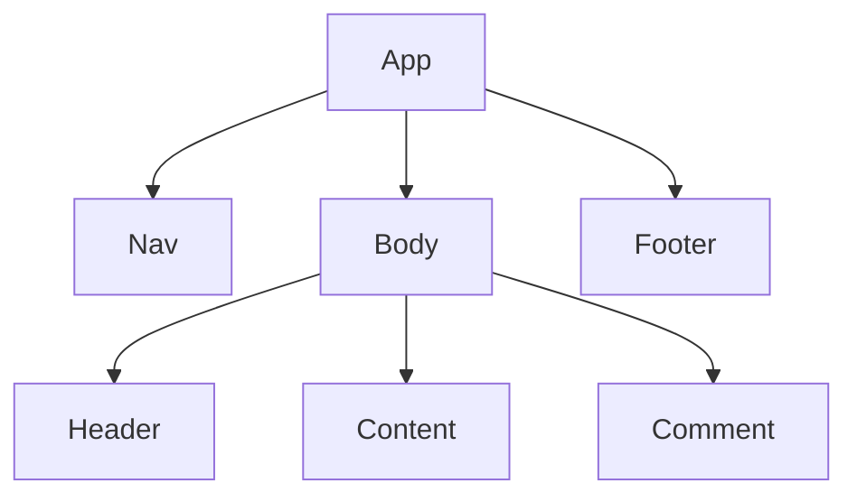

## React性能优化
### 为什么React需要性能优化API?

如图我们创建了一个React组件根组件APP和他下面的子组件，当我们更新Comment组件的时候，React会从APP组件开始重新创建树，这样就导致了性能的低。我们需要在重新创建树的时候跳过没有更新的组件。

2. React性能优化应该遵循的法则

优化的原则就是将变于不变的部分分离，变的部分有三种，`props`、`state`、`context`。
3. 性能优化背后的源码运行机制
