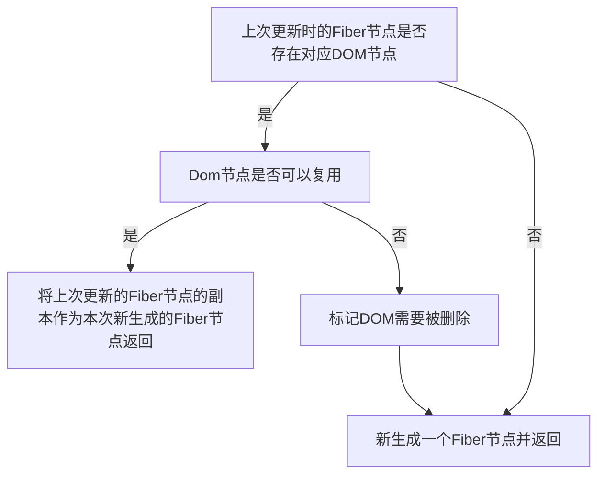

[diff算法](#1)
  - [单节点](#2)
  - [多节点](#3)
    + [多节点newChildren与oldFiber都没遍历完](#4)
      - [Demo1](#5)
      - [Demo2](#6)
  - [参考资料](#7)

<p id=1></p>

## diff算法

<p id=2></p>

### 单节点



<p id=3></p>

### 多节点

Diff算法可以是以下的设计思路：
1. 判断当前节点的更新属于哪种情况
2. 如果是新增，执行新增逻辑
3. 如果是删除，执行删除逻辑
4. 如果是更新，执行更新逻辑
但是由于不同的操作优先级不一样，所以无法使用上面的设计思路。

**在开发中，相对于新增和删除，更新组件更加的频繁，所以Diff算法会优先判断当前节点是否属于更新。**

Diff算法的设计思路是整体逻辑遍历两轮：
1. 第一轮遍历：处理`更新`的节点
2. 第二轮遍历：处理`不是更新`的节点

第一轮遍历：

```mermaid
graph TB;
subgraph 第一轮遍历
leti=0,遍历newChildren,将newChildreni与oldFiber比较,判断DOM节点是否可复用--可复用-->i++,继续比较newChildreni与oldFiber.sibling,可以复用则继续遍历
leti=0,遍历newChildren,将newChildreni与oldFiber比较,判断DOM节点是否可复用--key不同,不可复用-->立即跳出整个遍历
立即跳出整个遍历-->第一轮遍历结束
leti=0,遍历newChildren,将newChildreni与oldFiber比较,判断DOM节点是否可复用--key相同,type不同,不可复用-->会将oldFiber标记为DELETION,并继续遍历
i++,继续比较newChildreni与oldFiber.sibling,可以复用则继续遍历-->如果newChildren遍历完,或者oldFiber遍历完,跳出遍历
如果newChildren遍历完,或者oldFiber遍历完,跳出遍历-->第一轮遍历结束
end
subgraph 第二轮遍历
第二轮遍历开始-->newChildren与oldFiber同时遍历完-->diff算法结束
第二轮遍历开始-->newChildren没遍历完,oldFiber遍历完,需要增加节点-->遍历剩下的newChildren为生成的workInProgressfiber依次标记Placement
第二轮遍历开始-->newChildren遍历完,oldFiber没遍历完,需要删除节点-->需要遍历剩下的oldFiber,依次标记删除
第二轮遍历开始-->newChildren与oldFiber都没遍历完,节点在这次更新中改变了位置,最精髓难懂的部分
newChildren与oldFiber都没遍历完,节点在这次更新中改变了位置,最精髓难懂的部分-->将还未处理的oldFiber存入map中
将还未处理的oldFiber存入map中-->lastPlacedIndex为最后一个可复用节点在oldFiber中的位置,oldIndex表示遍历到的可复用节点在oldFiber中的位置
lastPlacedIndex为最后一个可复用节点在oldFiber中的位置,oldIndex表示遍历到的可复用节点在oldFiber中的位置--oldIndex大于等于lastPlacedIndex-->不移动位置,执行lastPlacedIndex=oldIndex
lastPlacedIndex为最后一个可复用节点在oldFiber中的位置,oldIndex表示遍历到的可复用节点在oldFiber中的位置--oldIndex小于lastPlacedIndex-->本次更新的节点向右移动
end
第一轮遍历结束-->第二轮遍历开始
```

<p id=4></p>

#### 多节点newChildren与oldFiber都没遍历完

<p id=5></p>

##### Demo1
```js

// 之前
abcd

// 之后
acdb

===第一轮遍历开始===
a（之后）vs a（之前）  
key不变，可复用
此时 a 对应的oldFiber（之前的a）在之前的数组（abcd）中索引为0
所以 lastPlacedIndex = 0;

继续第一轮遍历...

c（之后）vs b（之前）  
key改变，不能复用，跳出第一轮遍历
此时 lastPlacedIndex === 0;
===第一轮遍历结束===

===第二轮遍历开始===
newChildren === cdb，没用完，不需要执行删除旧节点
oldFiber === bcd，没用完，不需要执行插入新节点

将剩余oldFiber（bcd）保存为map

// 当前oldFiber：bcd
// 当前newChildren：cdb

继续遍历剩余newChildren

key === c 在 oldFiber中存在
const oldIndex = c（之前）.index;
此时 oldIndex === 2;  // 之前节点为 abcd，所以c.index === 2
比较 oldIndex 与 lastPlacedIndex;

如果 oldIndex >= lastPlacedIndex 代表该可复用节点不需要移动
并将 lastPlacedIndex = oldIndex;
如果 oldIndex < lastplacedIndex 该可复用节点之前插入的位置索引小于这次更新需要插入的位置索引，代表该节点需要向右移动

在例子中，oldIndex 2 > lastPlacedIndex 0，
则 lastPlacedIndex = 2;
c节点位置不变

继续遍历剩余newChildren

// 当前oldFiber：bd
// 当前newChildren：db

key === d 在 oldFiber中存在
const oldIndex = d（之前）.index;
oldIndex 3 > lastPlacedIndex 2 // 之前节点为 abcd，所以d.index === 3
则 lastPlacedIndex = 3;
d节点位置不变

继续遍历剩余newChildren

// 当前oldFiber：b
// 当前newChildren：b

key === b 在 oldFiber中存在
const oldIndex = b（之前）.index;
oldIndex 1 < lastPlacedIndex 3 // 之前节点为 abcd，所以b.index === 1
则 b节点需要向右移动
===第二轮遍历结束===

最终acd 3个节点都没有移动，b节点被标记为移动
```

<p id=6></p>

##### Demo2
```js
// 之前
abcd

// 之后
dabc

===第一轮遍历开始===
d（之后）vs a（之前）  
key改变，不能复用，跳出遍历
===第一轮遍历结束===

===第二轮遍历开始===
newChildren === dabc，没用完，不需要执行删除旧节点
oldFiber === abcd，没用完，不需要执行插入新节点

将剩余oldFiber（abcd）保存为map

继续遍历剩余newChildren

// 当前oldFiber：abcd
// 当前newChildren dabc

key === d 在 oldFiber中存在
const oldIndex = d（之前）.index;
此时 oldIndex === 3; // 之前节点为 abcd，所以d.index === 3
比较 oldIndex 与 lastPlacedIndex;
oldIndex 3 > lastPlacedIndex 0
则 lastPlacedIndex = 3;
d节点位置不变

继续遍历剩余newChildren

// 当前oldFiber：abc
// 当前newChildren abc

key === a 在 oldFiber中存在
const oldIndex = a（之前）.index; // 之前节点为 abcd，所以a.index === 0
此时 oldIndex === 0;
比较 oldIndex 与 lastPlacedIndex;
oldIndex 0 < lastPlacedIndex 3
则 a节点需要向右移动

继续遍历剩余newChildren

// 当前oldFiber：bc
// 当前newChildren bc

key === b 在 oldFiber中存在
const oldIndex = b（之前）.index; // 之前节点为 abcd，所以b.index === 1
此时 oldIndex === 1;
比较 oldIndex 与 lastPlacedIndex;
oldIndex 1 < lastPlacedIndex 3
则 b节点需要向右移动

继续遍历剩余newChildren

// 当前oldFiber：c
// 当前newChildren c

key === c 在 oldFiber中存在
const oldIndex = c（之前）.index; // 之前节点为 abcd，所以c.index === 2
此时 oldIndex === 2;
比较 oldIndex 与 lastPlacedIndex;
oldIndex 2 < lastPlacedIndex 3
则 c节点需要向右移动

===第二轮遍历结束===
```

<p id=7></p>

### 参考资料
[1][React技术揭秘](https://react.iamkasong.com/)