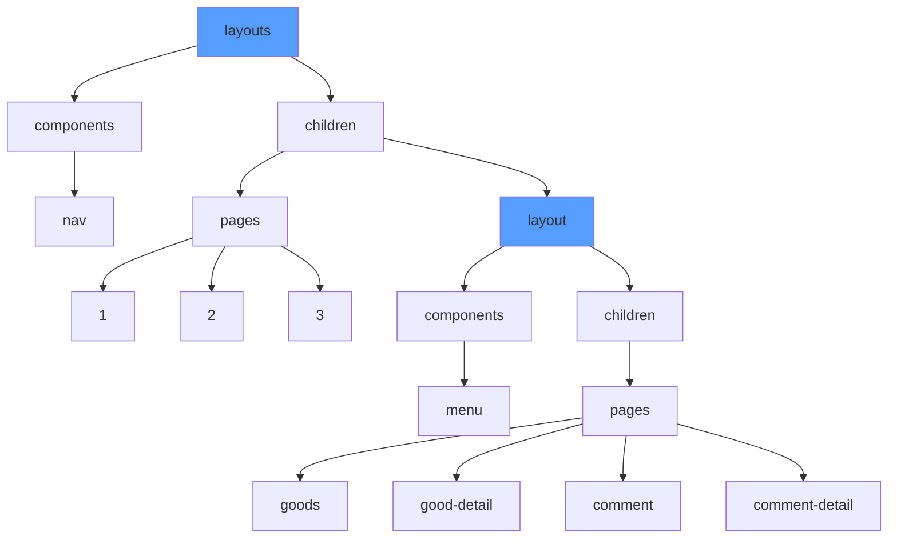
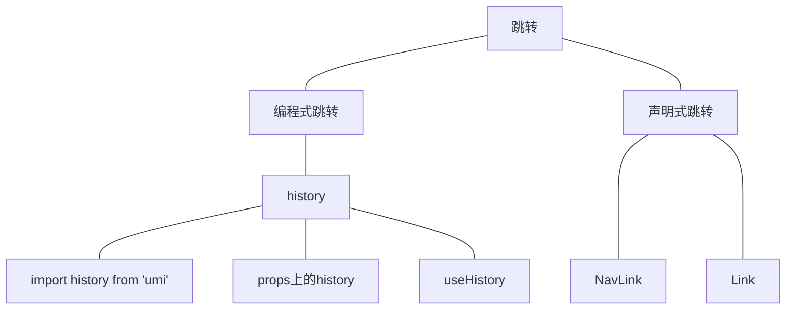

## [Umi3](../../Test/frameTest/Umi3/)

### 项目创建
1. 创建脚手架
```
yarn create @umijs/umi-app
或
npx @umijs/create-umi-app
```
2. 安装依赖
```
yarn
```
3. 启动项目
```
yarn start
```

### 项目目录

### 项目配置
UMI的默认配置文件是`.umirc.ts`，如果配置多的话，我们可以将`.umirc.ts`文件删除，在根目录下创建`config`文件夹，在里面配置不同的配置文件。

### umi3-5-antd
如果我们引入antd-mobile版本是默认的v2版本。
```tsx
import { Button } from 'antd';
import { Button as V2Button } from 'antd-mobile';//默认v2版本
```
我们可以将`@umijs/preset-react`的版本升级到最新，让默认版本变成v5
```
yarn add @umijs/preset-react -S
```
```tsx
import { Button } from 'antd';
import { Button as V2Button } from 'antd-mobile-v2';//v2版本
import { Button as V5Button } from 'antd-mobile';//默认v5版本


export default function IndexPage() {
  return (
    <div>
      <Button type='primary'>按钮</Button>
      <V2Button type='primary' size='small' inline>按钮v2</V2Button>
      <V5Button color='primary'>按钮v5</V5Button>
    </div>
  );
}
```

### 配置主题
antd pc端配置，只需要在配置文件里面写入：
```
theme:{
  '@primary-color':'#399',//ps端
}
```
antd v5配置，需要现在`src`下面创建`global.less`。
```less
:root:root{
  --adm-color-primary:#399;
}
```

### 图片和资源的引入
在根目录创建`public`文件夹，来存放静态图片。
```tsx
// 可以使用相对路径的方式引入，/就代表了public文件夹

```
也可以在`src`中创建`assest`文件夹，在`assest`中创建`images`文件夹。
```tsx
import user from '../assets/images/favicon.ico';


```
在css中引入背景图片。
```less
.box1{
  background: url('/favicon.ico');//public文件夹下
}
.box2{
  background: url('../assets/images/favicon.ico');
}
.box3{
  background: url('~@/assets/images/favicon.ico');//~@表示src文件夹
}
```

### less样式模块化
全局的less变量定义在`src`下的`global.less`里。对于全局的样式不需要引入就可以直接使用。

### 路由、权限路由、动态路由
UMI是约定式路由和配置型路由，约定式路由就是你合理的创建文件，在不写任何配置的情况下就可以使用路由，但是当项目比较大的时候，还是使用配置型路由。
配置型路由权重比约定式是路由高。
配置型路由的配置文件在`config`中的`routers.ts`
```
export default [
  { path: '/', component: '@/pages/index' },
  { path: '/login', component: '@/pages/login' },
  { path: '/reg', component: '@/pages/reg' },
  {component: '@/pages/404' },
]
```
**注意：创建的逐渐要默认暴露，路由里面才能检测到**

动态路由
```
{ path: '/goods/:id', component: '@/pages/goods' },
```
路由鉴权
```ts
//routes.ts
{ 
  path: '/reg',
  wrappers: ['@/wrappers/auth'],
  component: '@/pages/reg'
},
//wrappers auth
import React, { ReactNode } from 'react'
import { Redirect } from 'umi'

function Auth(props:{childern:ReactNode}) {
  if(Math.random() < .5){
    return (
      <>{props.childern}</>
    )
  }else{
    return <Redirect to='/login' />
  }
}

export default Auth
```

layouts布局



### 页面跳转



1. 编程式跳转

2. 声明式跳转

### mock
```js
export default {
  'GET /umi/good':[
    { id:1,name:'name1' },
    { id:2,name:'name2' }
  ],
  'POST /api/users/create': (req,res)=>{
    res.end('OK');
  }
}
```
模拟延时
```js
import { delay } from 'roadhog-api-doc';//模拟延时

export default delay({
  'GET /umi/good':[
    { id:1,name:'name1' },
    { id:2,name:'name2' }
  ],
  'POST /api/users/create': (req,res)=>{
    res.end('OK');
  }
},2000)
```

### 反向代理
```ts
export default {
  '/api':{
    target: 'https://localhost:9001',//代理真实服务器
    https:true,//从http代理到https
    changeOrigin:true,//依赖origin的功能需要这个，比如cookie
    pathRwrite:{'^/api':''},//替换路径
  }
}
```

### request
request是umi自带的请求数据的工具。和axios的用法很像。
```tsx
import { request } from 'umi';
const getGood = async () => {
  let res = await request('/umi/good');
  console.log(res);
}
const Login = async () => {
  let res = await request('/umi/good',{
    method: 'POST',
    data: {
      username: '',
      password: ''
    }
  });
  console.log(res);
}
```


### useRequest
useRequest 要求 必须返回一个data字段
```tsx
import { useRequest } from 'umi';
const {data,error,loading} = useRequest('/umi/good');
const {data2,error2,loading2} = useRequest({
    url: '/umi/good'
});
```
```tsx
//当添加配置manual:true的时候，必须调用run函数才会执行并返回数据
const {data,error,loading,run} = useRequest('/umi/good',{manual:true});
```
轮询
```tsx
const {data,error,loading,run} = useRequest('/umi/good',{
    manual:true,
    pollingInterval: 1000,//每一秒轮询一次
    pollingWhenHidden: false,//屏幕不可见时，暂停轮询
});
```

### dva

```mermaid
graph LR;
URL-->RouteComponent
RouteComponent-->dispatch
RouteComponent-->c1组件
RouteComponent-->c2组件
dispatch-->Action
Action-->Reducer,同步
Action-->Effect,异步
subgraph Model
	Reducer,同步
	Effect,异步
	Subscription
end
Subscription.->Action
Effect,异步-->Server,服务器
Server,服务器-->Reducer,同步
Reducer,同步-->State
State--connect-->RouteComponent
```


基于redux和redux-saga的数据流解决方案。
dva的文件在`src`下的`models`下的`global.js`文件中

```js
export default {
  // namespace: 'global',//所有的models里面的namespace不能重名
  //初始化全局数据
  state:{
    title: '全局title',
    text: '全局text',
    login: false,
    a: '全局models aaaa'
  },

  //处理同步业务
  reducers: {
    setText(state){
      //copy 更新 并返回
      return {
        ...state,
        text: '全局 设置后的 text' + Math.random().toFixed(2)
      }
    },
    setTitle(state,action){
      //copy 更新 并返回
      return {
        ...state,
        text: `全局 设置后的 title'/${action.payload}/${Math.random().toFixed(2)}`
      }
    }
  }
}
```
上面这段代码我们就定义了全局的变量和方法，我们可以通过下面的代码在页面中使用全局变量
```tsx
import React, {JSXElementConstructor, useEffect} from 'react';
import {connect} from 'umi'
interface Props{
  dispatch:({})=>{},
  [key:string]:string|(({})=>{})
}
const Dva:JSXElementConstructor<never> = (props:Props) => {
  return (
    <div>
      Dva
      <h1>获取全局数据</h1>
      <div>text:{props.text}</div>
      <div>title:{props.title}</div>
      <div>A:{props.A}</div>
      {props.isLogin?<div>已登录</div>:<div>未登录</div>}
      <button onClick={()=>props.dispatch({
        type: 'global/setText'
      })}>按钮</button>
    </div>
  );
};
export default connect((state:{
  global:{[key:string]:string}
})=>({
  //抓取全局，重命名
  text: state.global.text,
  title: state.global.title,
  A: state.global.a,
  isLogin: state.global.login
}))(Dva)
```
我们不仅可以创建全局的数据，我们也可以创建页面级别的数据，我们只需要在组件对应的文件夹下面创建`model.ts`或`model.ts`. 如果我们要创建多个文件，则可以创建`models`文件夹，将

### 启用connect 使用hooks

```tsx
import React from 'react';
import {useDispatch,useSelector} from 'umi'

const Child = () => {
    const dispatch = useDispatch();
    const data = useSelector((state:{global:{
            a:string
            login: boolean
            text:string
            title:string
        }}) => state.global);
    return (
        <div>
            child
            <div>{data.text}</div>
            <div>{data.title}</div>
            <button onClick={()=>{
                dispatch({type:'global/setText'});
                dispatch({type:'global/setTitle',payload:1});
            }}>按钮</button>
        </div>
    );
};

export default Child;
```

### subscription源获取
```tsx
import {request} from "umi";
import key from 'keymaster'

export default {
  // namespace: 'global',//所有的models里面的namespace不能重名
  //初始化全局数据
  state:{
    title: '全局title',
    text: '全局text',
    login: false,
    a: '全局models aaaa'
  },

  //处理同步业务
  reducers: {
    setText(state){
      //copy 更新 并返回
      return {
        ...state,
        text: '全局 设置后的 text' + Math.random().toFixed(2)
      }
    }
  },

  subscriptions: {
    //监听路由
    listenRoute({dispatch,history}){
      history.listen(({pathname,query})=>{
        console.log('global subscription',pathname,query)
      })
    },

    //监听按键
    listenKeyBoard({dispatch}){
      key('ctrl+i',()=>{
        console.log('你按下了ctrl+i');
        dispatch({type:'setText'})
      })
    }
  }
}
```

### 运行时的配置

#### 渲染浅的权限效验
在`src`下创建`app.ts`文件
```tsx
import {history} from 'umi'
import {ReactNode} from "react";

export const render = async (oldRender: (()=>ReactNode)) => {
  //oldRender   需要至少调用一次
  // history.push('/login')//这里判断一下是否登录，并且是否是个人中心什么的，如果没登录则无法进入。
  let isLogin = true
  if(isLogin){
    history.push('/login')
  }
  oldRender()
};

```
#### 动态路由读取、添加
在`src`下创建`app.ts`文件

#### 路由监听，埋点统计
在`src`下创建`app.ts`文件
```tsx
export function onRouteChange({matchedRoutes,location,routes,action}:any){
  //添加标题
  document.title = matchedRoutes[matchedRoutes.length-1].route.title||'heheda'
}
```
#### 拦截器
在`src`下创建`app.ts`文件
```tsx
export const request = {
  // timeout: 1000,//延时
  // errorConfig: {},//错误处理
  // middlewares: [],//使用中间件
  //请求拦截
  requestInterceptors: [
    (url:any,options:any)=>{
      options.headers = {token:'123456'}
      return {url,options}
    }
  ],

  responseInterceptors: [
    (response:any,options:any)=>{
      return response;
    }
  ]
};
```
