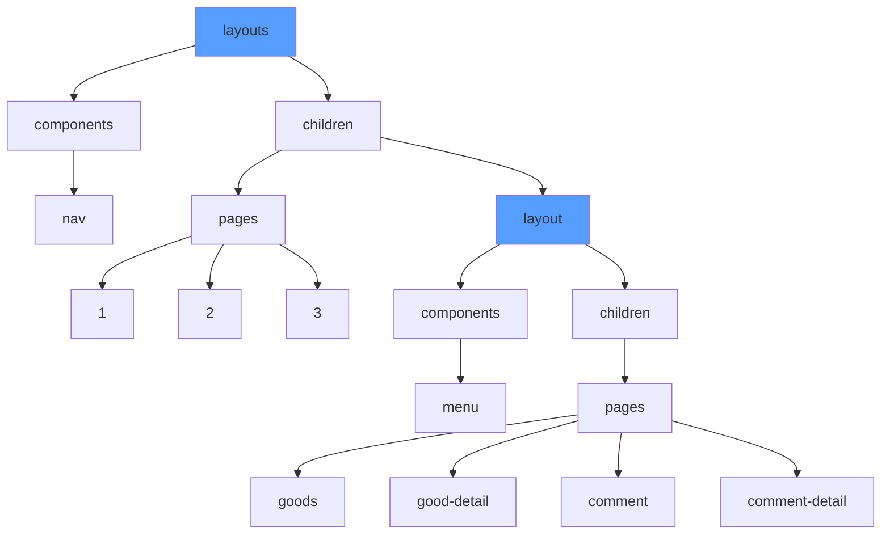
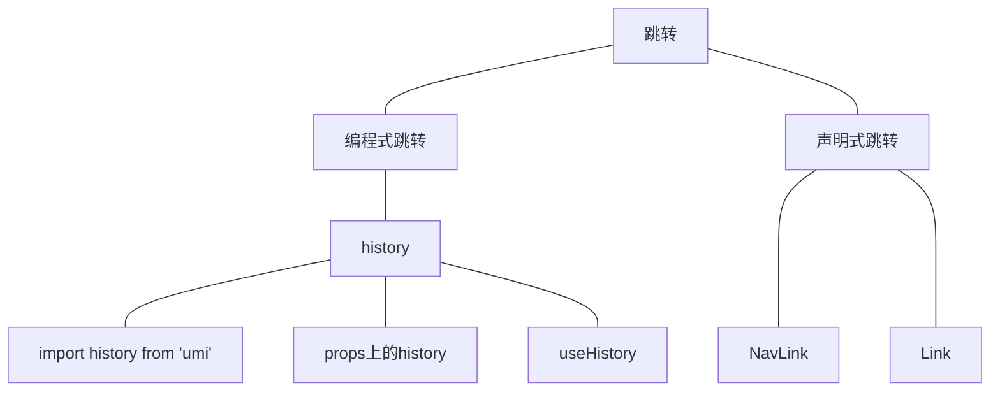

## Umi3

### 项目创建
1. 创建脚手架
```
yarn create @umijs/umi-app
或
npx @umijs/create-umi-app
```
2. 安装依赖
```
yarn
```
3. 启动项目
```
yarn start
```

### 项目目录

### 项目配置
UMI的默认配置文件是`.umirc.ts`，如果配置多的话，我们可以将`.umirc.ts`文件删除，在根目录下创建`config`文件夹，在里面配置不同的配置文件。

### umi3-5-antd
如果我们引入antd-mobile版本是默认的v2版本。
```tsx
import { Button } from 'antd';
import { Button as V2Button } from 'antd-mobile';//默认v2版本
```
我们可以将`@umijs/preset-react`的版本升级到最新，让默认版本变成v5
```
yarn add @umijs/preset-react -S
```
```tsx
import { Button } from 'antd';
import { Button as V2Button } from 'antd-mobile-v2';//v2版本
import { Button as V5Button } from 'antd-mobile';//默认v5版本


export default function IndexPage() {
  return (
    <div>
      <Button type='primary'>按钮</Button>
      <V2Button type='primary' size='small' inline>按钮v2</V2Button>
      <V5Button color='primary'>按钮v5</V5Button>
    </div>
  );
}
```

### 配置主题
antd pc端配置，只需要在配置文件里面写入：
```
theme:{
  '@primary-color':'#399',//ps端
}
```
antd v5配置，需要现在`src`下面创建`global.less`。
```less
:root:root{
  --adm-color-primary:#399;
}
```

### 图片和资源的引入
在根目录创建`public`文件夹，来存放静态图片。
```tsx
// 可以使用相对路径的方式引入，/就代表了public文件夹

```
也可以在`src`中创建`assest`文件夹，在`assest`中创建`images`文件夹。
```tsx
import user from '../assets/images/favicon.ico';


```
在css中引入背景图片。
```less
.box1{
  background: url('/favicon.ico');//public文件夹下
}
.box2{
  background: url('../assets/images/favicon.ico');
}
.box3{
  background: url('~@/assets/images/favicon.ico');//~@表示src文件夹
}
```

### less样式模块化
全局的less变量定义在`src`下的`global.less`里。对于全局的样式不需要引入就可以直接使用。

### 路由、权限路由、动态路由
UMI是约定式路由和配置型路由，约定式路由就是你合理的创建文件，在不写任何配置的情况下就可以使用路由，但是当项目比较大的时候，还是使用配置型路由。
配置型路由权重比约定式是路由高。
配置型路由的配置文件在`config`中的`routers.ts`
```
export default [
  { path: '/', component: '@/pages/index' },
  { path: '/login', component: '@/pages/login' },
  { path: '/reg', component: '@/pages/reg' },
  {component: '@/pages/404' },
]
```
**注意：创建的逐渐要默认暴露，路由里面才能检测到**

动态路由
```
{ path: '/goods/:id', component: '@/pages/goods' },
```
路由鉴权
```ts
//routes.ts
{ 
  path: '/reg',
  wrappers: ['@/wrappers/auth'],
  component: '@/pages/reg'
},
//wrappers auth
import React, { ReactNode } from 'react'
import { Redirect } from 'umi'

function Auth(props:{childern:ReactNode}) {
  if(Math.random() < .5){
    return (
      <>{props.childern}</>
    )
  }else{
    return <Redirect to='/login' />
  }
}

export default Auth
```

layouts布局



### 页面跳转



1. 编程式跳转

2. 声明式跳转
