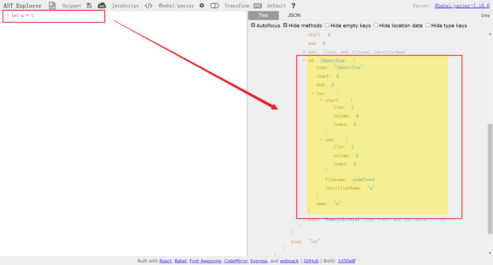
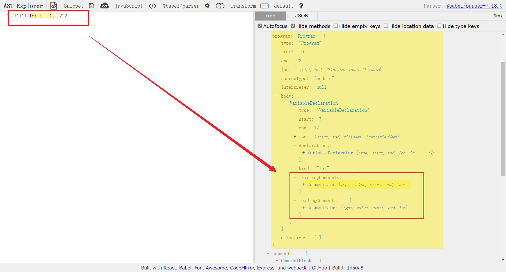

## Babel

### Babel的介绍
用来把代码中的 esnext 的新的语法、typescript 和 flow 的语法转成基于目标环境支持的语法的实现。同时Babel暴露了api让开发者可以进行特定用途的转换。除此以外，还可以做各种静态分析。

### Babel编译流程
Babel是一个转译器。
编译器是指`高级语言`到`低级语言`的转换工具
转译器是指`高级语言`到`高级语言`的转换工具
babel整体转译流程分为三步：
1. parse：通过`parser`把源码转成抽象语法树（AST）（之所以叫抽象语法树是因为省略掉了源码中的分隔符、注释等内容）
2. transform：遍历`AST`调用各种`transform`插件对`AST`进行增删改
3. generate：把转换后的`AST`打印成目标代码，并生成`sourcemap`

### AST
`AST`是对源码的抽象。`字面量、标识符、表达式、语句、模块语法、class语法`都有各自的不同的`AST`。
每种不同的`AST`也有公共的属性：
1. type:AST的节点类型
2. `start、end、loc`：`start`和`end`代表该节点在源码中的开始和结束下标。而`loc`属性是一个对象，有`line`和`column`属性分别记录开始和结束的行列号。

3. leadingComments、innerComments、trailingComments： 表示开始的注释、中间的注 释、结尾的注释，每个 AST 节点中都可能存在注释，而且可能在开始、中间、结束这三种位置，想拿到某个 AST 的注释就通过这三个属性。


### Babel的一些API
1. parse
   - @babel/parser：把源码转成 AST
2. transform
   - @babel/traverse：可以遍历 AST，并调用 visitor 函数修改 AST
   - @babel/types：visitor 函数对 AST 的判断、创建、修改等
   - @babel/template：批量创建 AST
3. generate
   - @babel/generator：把 AST 打印为目标代码字符串，同时生成 sourcemap
4. 其他
   - @babel/code-frame：中途遇到错误想打印代码位置的时候
   
### 插入函数调用参数
**需求一：**
需要将`console.log(1)`转换成`console.log('文件名（行号，列号）：',1)`
```js
const parser = require('@babel/parser');
const traverse = require('@babel/traverse').default;
const generate = require('@babel/generator').default;
const types = require('@babel/types');

const sourceCode = `
    console.log(1);

    function func() {
      console.info(2);
    }

    export default class Clazz {
      say() {
        console.debug(3);
      }
      render() {
        return <div>{console.error(4)}</div>
      }
    }
`;

//parser流程，把源码转成抽象语法树AST
const ast = parser.parse(sourceCode, {
    sourceType: 'unambiguous',
    plugins: ['jsx'],//开启jsx
});

//traverse流程，遍历AST调用各种transform插件对AST进行增删改
/*
* aim:我们想要把console.log('111')变成console.log('文件名（行号，列号）：','111');
* 这就需要我们在traverse流程中调用各种插件对AST进行修改
* */
//判断是否是console的API
const targetCalleeName = ['log','info','error','debug'].map(item=>`console.${item}`);
traverse(ast, {
    CallExpression(path, state) {
        //使用generate将callee的AST转换成字符串
        // const calleeName = generate(path.code.callee).code;

        //也可以使用path的toString方法将callee的AST转换成字符串
        const calleeName = path.get('callee').toString();

        //检测console的API
        if (targetCalleeName.includes(calleeName)) {
            //获取行和列
            const {line, column} = path.node.loc.start;
            //修改console的API输出
            path.node.arguments.unshift(types.stringLiteral(`filename:(${line},${column})`));
        }
    }
});

//generate流程，把转换后的AST打印成目标代码，并生成sourcemap
const {code, map} = generate(ast);

console.log(code);
```

**需求二：**
将
```js
console.log(1);
```
转换成
```js
console.log('文件名（行号，列号）：');
console.log(1);
```
要注意的点：jsx表达式不是在前面插入一个节点，而是要把整体替换成一个数组表达式，因为jsx中只支持写单个表达式。
```jsx
//将
<div>{console.log(1)}</div>
//转换成
<div>{[console.log('文件名（行号，列号）：'),console.log(1)]}</div>
```
```js
const parser = require('@babel/parser');
const traverse = require('@babel/traverse').default;
const generate = require('@babel/generator').default;
const types = require('@babel/types');
const template = require('@babel/template').default;

const sourceCode = `
    console.log(1);

    function func() {
      console.info(2);
    }

    export default class Clazz {
      say() {
        console.debug(3);
      }
      render() {
        return <div>{console.error(4)}</div>
      }
    }
`;

//parser流程，把源码转成抽象语法树AST
const ast = parser.parse(sourceCode, {
    sourceType: 'unambiguous',
    plugins: ['jsx'],//开启jsx
});

//traverse流程，遍历AST调用各种transform插件对AST进行增删改
/*
* aim:我们想要把console.log('111')变成console.log('文件名（行号，列号）：','111');
* 这就需要我们在traverse流程中调用各种插件对AST进行修改
* */
//判断是否是console的API
const targetCalleeName = ['log','info','error','debug'].map(item=>`console.${item}`);
traverse(ast, {
    CallExpression(path, state) {
        if(path.node.isNew)return;

        //使用generate将callee的AST转换成字符串
        // const calleeName = generate(path.code.callee).code;

        //也可以使用path的toString方法将callee的AST转换成字符串
        const calleeName = path.get('callee').toString();

        //检测console的API
        if (targetCalleeName.includes(calleeName)) {
            //获取行和列
            const {line, column} = path.node.loc.start;

            //生成console.log('文件名（行号，列号）：')字符串
            const newNode = template.expression(`console.log("filename: (${line}, ${column})")`)();

            newNode.isNew = true;
            //判断是不是jsx
            if(path.findParent(path => path.isJSXElement())){
                //将console的API转换成数组，替换原来的console的API
                path.replaceWith(types.arrayExpression([newNode,path.node]));
                path.skip();
            } else {
                //在console的API之前插入
                path.insertBefore(newNode);
            }
        }
    }
});

//generate流程，把转换后的AST打印成目标代码，并生成sourcemap
const {code, map} = generate(ast);

console.log(code);
```

### JS Parser的历史

### tarverse的path、scope、visitor
关于transform的流程，babel会递归遍历AST，在遍历过程中使用不同的visitor函数来实现transform，这种设计模式叫做访问者模式。
```js
path {
    // 属性：
   path.node //当前 AST 节点
   path.parent //父 AST 节点
   path.parentPath //父 AST 节点的 path
   path.scope //作用域
   path.hub //可以通过 path.hub.file 拿到最外层 File 对象， path.hub.getScope 拿到最外层作用域，path.hub.getCode 拿到源码字符串
   path.container //当前 AST 节点所在的父节点属性的属性值
   path.key //当前 AST 节点所在父节点属性的属性名或所在数组的下标
   path.listkey //当前 AST 节点所在父节点属性的属性值为数组时 listkey 为该属性名，否则为 undefined
    
    // 方法
   get(key) //获取某个属性的 path
   set(key, node) //设置某个属性的值
   getSibling(key) //获取某个下标的兄弟节点
   getNextSibling() //获取下一个兄弟节点
   getPrevSibling() //获取上一个兄弟节点
   getAllPrevSiblings() //获取之前的所有兄弟节点
   getAllNextSiblings() //获取之后的所有兄弟节点
   find(callback) //从当前节点到根节点来查找节点（包括当前节点），调用 callback（传入 path）来决定是否终止查找
   findParent(callback) //从当前节点到根节点来查找节点（不包括当前节点），调用 callback（传入 path）来决定是否终止查找
   inList() //判断节点是否在数组中，如果 container 为数组，也就是有 listkey 的时候，返回 true
   isXxx(opts) //判断当前节点是否是某个类型，可以传入属性和属性值进一步判断，比如path.isIdentifier({name: 'a'})
   assertXxx(opts) //同 isXxx，但是不返回布尔值，而是抛出异常
   insertBefore(nodes) //在之前插入节点，可以是单个节点或者节点数组
   insertAfter(nodes) //在之后插入节点，可以是单个节点或者节点数组
   replaceWith(replacement) //用某个节点替换当前节点
   replaceWithMultiple(nodes) //用多个节点替换当前节点
   replaceWithSourceString(replacement) //解析源码成 AST，然后替换当前节点
   remove() //删除当前节点
   traverse(visitor, state) //遍历当前节点的子节点，传入 visitor 和 state（state 是不同节点间传递数据的方式）
   skip() //跳过当前节点的子节点的遍历
   stop() //结束所有遍历
}
```


### Generator和SourceMap
generate把AST打印成字符串，对不同AST节点做不同的处理。在这个过程中抽象语法树中省略的一些分隔符重新加载回来。


### preset
plugin的格式
```js
// 返回对象的函数
export default function(api, options, dirname) {
   return {
      inherits: parentPlugin,
      manipulateOptions(options, parserOptions) {
         options.xxx = '';
      },
      pre(file) {
         this.cache = new Map();
      },
      visitor: {
         StringLiteral(path, state) {
            this.cache.set(path.node.value, 1);
         }
      },
      post(file) {
         console.log(this.cache);
      }
   };
} 
```
```js
export default plugin =  {
    pre(state) {
      this.cache = new Map();
    },
    visitor: {
      StringLiteral(path, state) {
        this.cache.set(path.node.value, 1);
      }
    },
    post(state) {
      console.log(this.cache);
    }
};
```
plugin 是单个转换功能的实现，当 plugin 比较多或者 plugin 的 options 比较多的时候就会导致使用成本升高。这时候可以封装成一个 preset，用户可以通过 preset 来批量引入 plugin 并进行一些配置。preset 就是对 babel 配置的一层封装。


### [自动埋点](../../Test/frameTest/Babel/plugin/exercize-auto-track)


### [Link](../../Test/frameTest/Babel/plugin/Link)
