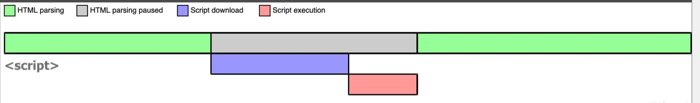
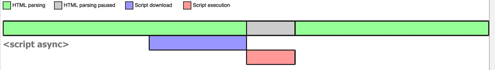
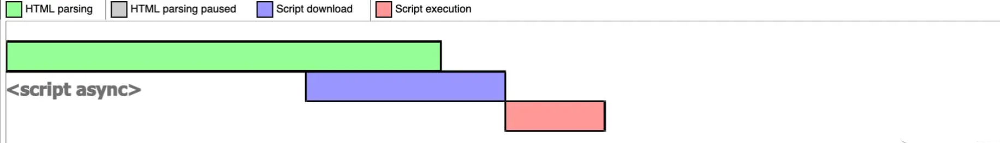
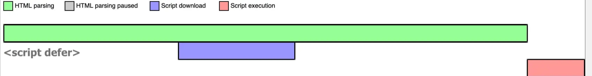

## HTML常见面试题

### src和href的区别
src和href都是对外部资源的引用。
src：表示对资源的引用，将指向的内容嵌入到标签所在的位置。src会将指向的资源下载并应用到文档中，如请求js脚本。所以会导致，当浏览器解析到src的时候，会停止对其他资源的下载和处理，先将src资源加载、编译、执行完。所以js脚本会放在页面底部。
href：表示超文本引用，它是与网络资源建立了链接。当浏览器识别到他指向的文件时，就会并行的下载资源，不会停止对其他资源的处理。比如link和a标签。

### 对HTML语义化的了解
语义化的标签会向浏览器和开发者传递它自身标签所包含的一些信息。比如nav标签表示导航，header标签表示头部。需要开发者根据页面内容和结构选择合适的标签。

语义化的优点：
对机器来说：
1. 对机器友好，因为标签本身就带有语义。
2. 更适合爬虫爬取有效信息，有利于SEO。
3. 语义类支持读屏软件，可以根据文章自动生成目录。
对开发者来说：
1. 对开发者友好，语义化标签增加了可读性。
2. 代码结构更加的清晰，开发者可以清晰的看到网页的结构。
3. 便于团队的开发与维护。

常见的语义化标签：
```html
<header>头部</header>
<nav>导航</nav>
<main>主要区域</main>
<article>主要内容</article>
<aside>侧边栏</aside>
<footer>底部</footer>
<section>区块（有语义化的div）</section>
```

### DOCTYPE(文档类型)的作用
DOCTYPE必须在第一行声明，告诉浏览器以什么样的文档定义来解析文档。

浏览器渲染页面的两种方式：可以通过document.compatMode来获取
1. CSS1Compat：标准模式
2. BackCompat：怪异模式（混杂模式）

如果没有写DOCTYPE，浏览器则会进入`怪异模式`，浏览器会以老版本的浏览器使用的规则来渲染页面。所以，`怪异模式`可能在不同浏览器上有不同的样式。
如果有写DOCTYPE，浏览器就会遵循DTD文档标准进入标准模式。（在html4及以前版本需要在文档中声明DTD，html5不需要，因为html5不遵循DTD标准）。

两种模式下提取浏览器尺寸时，使用语法不同。
标准模式：document.documentElement
怪异模式：document.body

### script标签中，defer和async的区别
1. 没有defer和async，浏览器会立即加载并执行脚本。会阻塞后续文档的加载。

2. async会异步请求网络脚本，如果请求回来后文档还没加载完，那么就会暂停文档的加载，先执行js代码，之后再加载文档。所以async可以阻塞文档加载也可能不阻塞。


3. defer会异步请求网络脚本，但是请求完成后不会立即执行，会等待文档加载完成后才执行脚本。defer不会阻塞文档的加载。


### 常⽤的meta标签有哪些
```html
<!-- 文档编码类型 -->
<meta charset='UTF-8' />
<!-- 页面关键词 -->
<meta name='keywords' content='关键词'/>
<!-- 页面描述 -->
<meta name='description' content='页面描述内容'/>
<!-- 页面重定向和刷新 -->
<meta http-equiv='refresh' content='0;url='/>
<!-- 适配移动端，可控制可视窗口的大小比例 -->
<meta name='viewport' content="width=device-width, initial-scale=1, maximum-scale=1"/>
<!-- width viewport ：宽度(数值/device-width)
height viewport ：高度(数值/device-height)
initial-scale ：初始缩放比例
maximum-scale ：最大缩放比例
minimum-scale ：最小缩放比例
user-scalable ：是否允许用户缩放(yes/no） -->

<!-- 搜索引擎索引方式 -->
<meta name='robots' content='index,follow'/>
<!-- all：文件将被检索，且页面上的链接可以被查询；
none：文件将不被检索，且页面上的链接不可以被查询；
index：文件将被检索；
follow：页面上的链接可以被查询；
noindex：文件将不被检索；
nofollow：页面上的链接不可以被查询。 -->
```

### HTML5有哪些更新
1. 标签语义化
    - <header>头部</header>
    - <nav>导航</nav>
    - <main>主要区域</main>
    - <article>主要内容</article>
    - <aside>侧边栏</aside>
    - <footer>底部</footer>
    - <section>区块（有语义化的div）</section>
2. 媒体标签

### img的srcset属性的作用？
img的srcset属性，不同屏幕密度下加载不同的图片。
```html

```
如果屏幕密度时1x，加载128图片，如果屏幕密度时2x，加载256图片。
但是如果按照这种方法加载，那不是每张图片都要加载一下吗？加载就会很慢，所以就有了新的srcset标准。
```html

```
只用srcset的单位是w时，sizes才生效。
```html

```
当宽度时500px时，取值400px，400在229和618之间，所以取最大的2.png。
如果sizes没有设置值或媒体条件下没有设置值则默认值是100vw。

### 行内元素有哪些？块级元素有哪些？空(void)元素有哪些？
空(void)元素也就是自闭和标签。
行内：a、b、span、img、strong、input、select
块级：div、p、h1 ~ h6、dl、dt、dd、ul、li、ol
空：input、img、br、hr、meta、link

### web worker

### title与h1的区别、b与strong的区别、i与em的区别？
i表示的斜体，em表示强调的文本。
strong标签具有语义化，有加重语气的作用，而b标签只是加粗。搜索引擎更侧重于strong标签。
title没有明确的意义只表示是个标题，h1表示层次明确的标题，对页面信息的抓取有更大的影响。

### iframe 有那些优点和缺点？

### label 的作用是什么？如何使用？

### head 标签有什么作用，其中什么标签必不可少？

### 浏览器乱码的原因是什么？如何解决？
1. 网页源代码是`gbk`编码，但是内容中的文字是`utf-8`编码，这样打开浏览器就会出现html乱码，反之也会出现乱码。
2. html是`gbk`编码，而从数据库返回的数据是`utf-8`编码，也会造成乱码。
3. 浏览器不能自动检测网页的编码，造成网页乱码。
解决方案：
1. 使用软件编辑html网页源代码。

### 说一下 HTML5 drag API

### 参考资料
[1][图解 script 标签中的 async 和 defer 属性](https://juejin.cn/post/6894629999215640583)
[2][「2021」高频前端面试题汇总之HTML篇](https://juejin.cn/post/6905294475539513352)