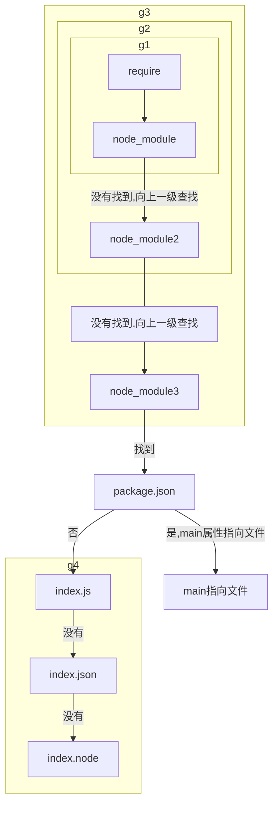

# Commonjs和EsModule

## Commonjs

### Commonjs实现原理-包装函数的本质
在编译的过程中，实际 Commonjs 对 js 的代码块进行了首尾包装，其本质是：
```js
function wrapper (script) {
    return '(function (exports, require, module, __filename, __dirname) {' + 
        script +
     '\n})'
}
```

### require文件加载流程
```js
const fs = require('fs')//核心模块
const sayName = require('./hello.js')//文件模块
const crypto =  require('crypto-js')//第三方自定义模块
```
1. 对于`fs、http、path`等核心模块，优先级仅次于缓存加载，在Node源码编译中，已经被编译成二进制代码，所以加载核心模块最快。
2. 以`./、../、/`开始的标识符，被当作文件模块处理，require()会将路径转换成真实路径，然后将编译后的结果缓存起来，在第二次加载的时候会更快。
3. 对于第三方自定义模块，会在当前的node_module目录查找，如果没有则查找上一级，知道根目录下的node_module。在查找过程中会查找package.json文件中的`mian`属性指向的文件，如果没有package.json则在node环境下依次查找`index.js、index.json、index.node`。


### require引入处理
1. 引入顺序：Commonjs`同步`加载并执行模块文件，采用深度优先遍历，执行顺序是`父->子->父`。
2. 加载原理：Node中，每一个js文件都是一个nodule，module上保存了exports等信息，还保存了loaded来表示该模块是否被加载，如果被加载则说明该模块在`Module`中缓存，直接读取。如果没加入缓存则加入缓存，然后执行文件。`这样就避免了循环引用和重复加载`。
3. 我们要注意的是，Commonjs是同步加载的，并且执行顺序是`父->子->父`，所以在`子`中引入`父`可能得不到数据。我们可以将其放入异步加载中`(例：setTimeout)`或动态加载。

### require的动态加载
动态加载是require的一个特性，require可以在任意的上下文动态加载模块，这正是区别于`Es Module`的地方。
```js
console.log('我是 a 文件')
exports.say = function(){
    const getMes = require('./b')
}
```

### exports和module.exports
#### exports
正确写法
```js
export.name = 'names';//导出
const a = require('./a')//引入
```
错误写法
```js
export = { name:'names' };//导出
const a = require('./a')//引入
```
#### module.exports
```js
module.exports = { name:'name' }//导出
module.exports = function(){}//导出
module.exports = 
```
**注意，export和module.exports不要混合使用，会出现覆盖的情况。**

## ES Module

### export和import
1. 混合导入导出
```js
//导出
const name = 'names' 
export { name }
export const say = function (){
    console.log('hello , world')
}
import { name,say } from './a.js'//引入导出
//默认导出
export default { name,say }
import msg from './a.js' //引入默认导出

import * as mes from './a.js'//将导出的属性合并到mes属性上
```

2. 重命名导入
```js
import { name as names } from './a.js'
```

3. 重定向导出
```js
export * from 'module'//重定向导出不包含module中default属性的所有属性
export { name } from 'module'//从module中导入name，再以name名称导出
export { name as names } from 'module'//从module中导入name，再以names名称导出
```

4. 运行模块
```js
import 'module'
```

5. 动态导入
```js
const msg = import('module');
```


