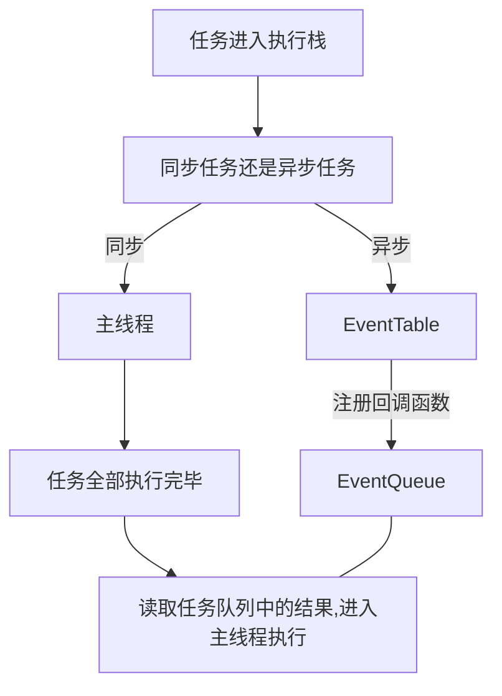

## JS事件循环机制event loop

### 同步和异步
我们先来看这样一段代码。
```js
setTimeout(()=>{
  console.log('333');
},0)
Promise.resolve()
.then(val=>{
  console.log('222');
})
console.log('1111');
```
它的输出顺序是111、222、333，为什么会按照这种顺序输出呢？



1. 同步和异步任务分别进入不同的执行场所，同步任务进入主线程，异步任务进入EventTable并注册函数。
2. 当指定的事情完成时（例如，延时器结束后），EventTable会将这个函数移入EventQueue。
3. 主线程内的任务执行完毕为空，回去EventQueue读取对应的函数进入主线程执行。
4. js引擎存在monitoring process进程，会持续不断的检查主线程执行栈是否为空，一旦为空，就会去Event Queue那里检查是否有等待被调用的函数。 

#### 同步

#### 异步

### 宏任务和微任务

### 宏任务
||浏览器|Node|
|:----:|:----:|:----:|
|I/O   |&#9745;|&#9745;|
|setTimeout|&#9745;|&#9745;|
|setInterval|&#9745;|&#9745;|
|setInnediate|&#9746;|&#9745;|
|requestAnimationFrame|&#9745;|&#9746;|

### 微任务
||浏览器|Node|
|:----:|:----:|:----:|
|process.nextTick|&#9746;|&#9745;|
|MutationObserver|&#9745;|&#9746;|
|Promise.then chat finally|&#9745;|&#9745;|


 
