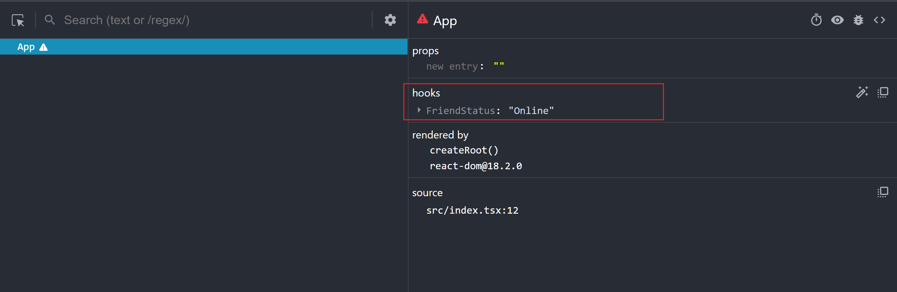

[<=返回](./index.md)
<hr/>

# React Hooks简单用法了解

## hooks数据更新驱动
### useState
```
const [state, dispatch] = useState(initData);
```
1. state是一个值，可以交给render来渲染。
2. dispatch是改变state的函数。
3. initData是state值得初始化值，可以是一个值也可以是一个函数，如果是一个函数则state的初始化值就是函数的返回值。
> Demo
```
import React, { useState } from 'react';
const App = ()=>{
  const [num, setNum] = useState(0);
  return <div onClick={()=>{
    setNum(num+1);
    console.log(num);//这里的num是不能够及时改变的
  }}>
    {num}
  </div>
}
export default App;
```
注意点：
1. 在函数组件的一次上下文中，state的值是固定不变的，及时你使用dispatch对state进行修改，在视图中state改变，但是打印的state还是没有改变。
2. 如果dispatch传入的值state的值不变或地址值不变，则组件不会更新。
```
import React, { useState } from 'react';
const App = ()=>{
  const [num, setNum] = useState({name: 'name'});
  return <div onClick={()=>{
    num.name = 'name2';
    setNum(num);//因为num的地址值没有改变，所以组件不会更新，视图也不会改变
  }}>
    {num.name}
  </div>
}
export default App;
```
3. dispatch在当前执行上下文中获取不到最新的state,只有在下一组件render中才能获取到。
### useReducer
```
const [state, dispatch] = useReducer(reducer);
```
1. state
2. dispatch和useState中的dispatch是一样的。
3. reducer是一个函数，接收两个参数，state和action，state是之前的state值，action是传入的值，如果state和action相同，则组件不会更新。
> Demo
```
import React, { useReducer } from 'react';
const App = ()=>{
  const [num, setNum] = useReducer((state:number, action:{name:'add'|'sub'|'reset'; payload:number})=>{
    const {name, payload} = action;
    switch(name){
      case 'add':
        return state + 1;
      case 'sub':
        return state - 1;
      case 'reset':
        return payload;
    }
  },0)
  return <div>
    当前值：{num}
    {/* 派发更新 */}
    <button onClick={()=>setNum({name:'add', payload:0})}>增加</button>
    <button onClick={()=>setNum({name:'sub', payload:0})}>减少</button>
    <button onClick={()=>setNum({name:'reset', payload: 666})}>赋值</button>
  </div>
}
export default App;
```
### useSyncExternalStore
```
useSyncExternalStore(
    subscribe,
    getSnapshot,
    getServerSnapshot
)
```
1. subscribe为订阅函数，当数据改变的时候会触发subscribe，useSyncExternalStore会通过带有记忆性的getSnapshot来判断数据是否发生变化，如果发生变化则会强制更新数据
2. getSnapshot 可以理解成一个带有记忆功能的选择器。当 store 变化的时候，会通过 getSnapshot 生成新的状态值，这个状态值可提供给组件作为数据源使用，getSnapshot 可以检查订阅的值是否改变，改变的话那么会触发更新。
3. getServerSnapshot 用于 hydration 模式下的 getSnapshot。
```
import React, { useReducer, useState, useSyncExternalStore } from 'react';
import {combineReducers, createStore} from 'redux'
function numberReducer(state=1,action:any){
  switch (action.type){
    case 'ADD':
      return state + 1
    case 'DEL':
      return state - 1
    default:
      return state
  }
}
const rootReducer = combineReducers({number: numberReducer});
const store = createStore(rootReducer,{number:1});
const App = ()=>{
  const state = useSyncExternalStore(store.subscribe,()=>store.getState().number);
  return <div>
    {state}
    <button onClick={()=>store.dispatch({type: 'ADD'})}>点击</button>
  </div>
}
export default App;
```
### useTransition 
```
const  [ isPending , startTransition ] = useTransition ()
```
1. isPending是出于过度状态的标志。
2. startTransition可以把更新任务变成过渡任务。
> Demo
```
import React, { useState, useTransition } from 'react';
/* 模拟数据 */
const mockList1 = new Array(10000).fill('tab1').map((item,index)=>item+'--'+index )
const mockList2 = new Array(10000).fill('tab2').map((item,index)=>item+'--'+index )
const mockList3 = new Array(10000).fill('tab3').map((item,index)=>item+'--'+index )

const tab = {
  tab1: mockList1,
  tab2: mockList2,
  tab3: mockList3
}
const App = ()=>{
  const [active, setActive] = useState('tab1');
  const [renderData, setRenderData] = useState(tab[active]);
  const [isPending, startTransition] = useTransition();
  function handleChangeTab(activeItem:string){
    setActive(activeItem);//立即更新
    startTransition(()=>{//startTransition里面的任务优先级低
      setRenderData(tab[activeItem]);
    })
  }
  return <div>
    <div className='tab'>
      {Object.keys(tab).map((item,idx)=><span key={idx} className={active === item ? 'active':''} onClick={()=>handleChangeTab(item)}>{item}</span>)}
    </div>
    <ul className='content'>
      {isPending&&<div>loading...</div>}
      {renderData.map((item:string)=><li key={item}>{item}</li>)}
    </ul>
  </div>
}
export default App;
```
### useDeferredValue
useDeferredValue和useTransition类似。它两个本质上和内部实现一样都是标记成了过渡更新任务。
useTransition是把其内部的更新任务变成了过渡任务transtion，而useDeferredValue是把原值通过过渡任务得到新的值，这个值作为延时状态。一个是处理一段逻辑，一个是产生一个新的状态。
```
const deferrredValue = React.useDeferredValue(value)
```
1. value一般为可变的state
2. deferrredValue是返回的延时状态
> Demo 将useTransition的例子用useDeferredValue实现
```
import React, { useDeferredValue, useState } from 'react';
import './index.css'
/* 模拟数据 */
const mockList1 = new Array(10000).fill('tab1').map((item,index)=>item+'--'+index )
const mockList2 = new Array(10000).fill('tab2').map((item,index)=>item+'--'+index )
const mockList3 = new Array(10000).fill('tab3').map((item,index)=>item+'--'+index )

const tab = {
  tab1: mockList1,
  tab2: mockList2,
  tab3: mockList3
}
const App = ()=>{
  const [active, setActive] = useState('tab1');
  const deferActive = useDeferredValue(active);
  function handleChangeTab(activeItem:string){
    setActive(activeItem);//立即更新
  }
  const renderData = tab[deferActive]//滞后状态
  return <div>
    <div className='tab'>
      {Object.keys(tab).map((item,idx)=><span key={idx} className={active === item ? 'active':''} onClick={()=>handleChangeTab(item)}>{item}</span>)}
    </div>
    <ul className='content'>
      {renderData.map((item:string)=><li key={item}>{item}</li>)}
    </ul>
  </div>
}

export default App;
```
## hooks执行副作用
### useEffect
useEffect、useLayoutEffect、useInsertionEffect弥补了函数组件没有生命周期的缺陷。其中最常用的就是 useEffect。
```
useEffect(()=>{
    return destory
},dep)
```
1. 第一个参数-callbacb，返回的destory作为下一次callback执行之前调用，可以用来清除上一次callback产生的副作用，可以代替卸载组件的声明周期。
2. dep是依赖项，是一个数组，可以有多个依赖项。当dep发生改变，执行上一次callback返回的destory，和执行新的effect第一个参数callback。
对于 useEffect 执行， React 处理逻辑是采用异步调用 ，对于每一个 effect 的 callback， React 会向 setTimeout回调函数一样，放入任务队列，等到主线程任务完成，DOM 更新，js 执行完成，视图绘制完毕，才执行。所以 effect 回调函数不会阻塞浏览器绘制视图。
> Demo
```
import React, { useEffect } from "react";
//模仿请求数据
function msg(){
  return new Promise((resolve)=>{
    setTimeout(()=>{
      resolve({
        name: 'name1',
        age: 16
      })
    },500)
  })
}
const App = ()=>{
  //因为useEffect第二个参数为空数组，说明这个useEffect只执行一次，相当于mouted生命周期函数
  useEffect(()=>{
    msg().then(val=>{
      console.log(val);
    })
  },[]);
  return <div></div>
}
export default App;
```
useEffect 中做的功能如下：
1. 请求数据。
2. 设置定时器,延时器等。
3. 操作 dom , 在 React Native 中可以通过 ref 获取元素位置信息等内容。
4. 注册事件监听器, 事件绑定，在 React Native 中可以注册 NativeEventEmitter 。
5. 还可以清除定时器，延时器，解绑事件监听器等。
### useLayoutEffect
useLayoutEffect和useEffect的区别
1. useLayoutEffect是同步的，useEffect是异步的。
2. useLayoutEffect是在DOM更新之后，浏览器绘制之前。useEffect是在DOM更新之后，浏览器绘制之后。所以如果要修改DOM可以在useLayoutEffect中，这样避免了在useEffect中，绘制过后再次绘制。
3. useLayoutEffect callback 中代码执行会阻塞浏览器绘制。
因为useLayoutEffect是在DOM结构更新后，渲染前执行，所以相当于有一个防抖效果。
```
import React, { useEffect, useState } from "react";

const App = ()=>{
  const [value, setValue] = useState(0);
  useEffect(() => {
    if (value === 0) {
      setValue(10 + Math.random() * 200);
    }
  }, [value]);
  console.log("render", value);
  return (
    <div onClick={() => setValue(0)}>value: {value}</div>
  );
}

export default App;
```
上面的代码执行的顺序是：
1. 点击
2. 虚拟DOM设置到真实DOM上
3. 渲染
4. 执行useEffect回调
5. 调用setVlaue更新value
6. 虚拟DOM设置到真实DOM上
7. 渲染
因为在很短的时间内渲染了两次，所以导致页面会出现闪动。
我们可以用useLayoutEffect改进。
```
import React, { useLayoutEffect, useState } from "react";

const App = ()=>{
  const [value, setValue] = useState(0);
  useLayoutEffect(() => {
    if (value === 0) {
      setValue(10 + Math.random() * 200);
    }
  }, [value]);
  console.log("render", value);
  return (
    <div onClick={() => setValue(0)}>value: {value}</div>
  );
}

export default App;
```
上面的代码执行的顺序是：
1. 点击
2. 虚拟DOM设置到真实DOM上
3. 执行useLayoutEffect回调
4. 调用setVlaue更新value
5. 虚拟DOM设置到真实DOM上
6. 渲染
上面的代码只渲染了一次，不会出现页面闪动。
### useInsertionEffect(一般不使用)
1. useInsertionEffect比useLayoutEffect和useEffect的执行都要靠前。
2. useInsertionEffect执行的时候，DOM还没有更新。
3. useInsertionEffect主要解决css-in-js在渲染中注入样式的性能问题。
> Demo
```
import React, { useInsertionEffect } from "react";

const App = ()=>{
  useInsertionEffect(()=>{
    const style = document.createElement('style');
    style.innerHTML = `
      .css-in-js{
        color: red;
        font-size: 20px;
      }
    `
    document.head.appendChild(style);
  },[]);
  return <div className="css-in-js">123</div>
}

export default App;
```
## hooks状态获取与传递
### useContext
可以使用useContext接收父组件传过来的参数，也可以使用Context.Consumer接收父组件传过来的参数。
> Demo
```
//App.tsx文件
import React, { createContext, useContext, useState } from "react";
import { Children2 } from "./components/children";
export const CountContext = createContext({num:0,count:0});
const App = ()=>{
  const [num, setNum] = useState(666);
  const [count, setCount] = useState(888);
  return <div>
    <p>父组件num和count：{num},{count}</p>
    <button onClick={()=>setNum(num+1)}>点击</button>
    <button onClick={()=>setCount(count-1)}>点击</button>
    <CountContext.Provider value={{num,count}}>
      <Children/>
      <Children2/>
    </CountContext.Provider>
  </div>
}
export const Children = ()=>{
  const {num, count} = useContext(CountContext);
  return <div>子组件num和count：{num},{count}</div>
}
export default App;

//子组件文件
import React from 'react';
import { CountContext } from '../../App';

export const Children2 = ()=>{
  return <CountContext.Consumer>
    {
      ({num, count})=><div>子组件num和count：{num},{count}</div>
    }
  </CountContext.Consumer>
}
```
### useRef
useRef可以用来获取DOM元素，缓存状态，在React Native中虽然没有 DOM 元素，但是也能够获取组件的节点信息。
```
const cur = React.useRef(initState)
console.log(cur.current)
```
1. cur上有一个current就是ref对象需要获取的内容。
2. initState是初始化值。
> Demo
```
import React, { useRef } from "react";
const App = ()=>{
  const dom = useRef(null);
  const click = ()=>{
    console.log(dom.current);
  }
  return <div>
    <div ref={dom}>DOM</div>
    <button onClick={click}>点击</button>
  </div>
}
export default App;
```
useRef 保存状态， 可以利用 useRef 返回的 ref 对象来保存状态，只要当前组件不被销毁，那么状态就会一直存在。
> Demo
```
import React, { useRef } from "react";

const App = ()=>{
  const dom = useRef(false);
  const click = ()=>{
    dom.current = !dom.current;
    console.log(dom.current);
  }
  return <div>
    <button onClick={click}>点击</button>
  </div>
}

export default App;
```
### useImperativeHandle
对于子组件，如果是 class 类组件，我们可以通过 ref 获取类组件的实例，但是在子组件是函数组件的情况，如果我们就需要useImperativeHandle和forwardRef配合来实现。
```
useImperativeHandle(ref,createHandle,deps)
```
1. 第一个参数ref是接收forWardRef传过来的ref。
2. 第二个参数createHandle是处理函数，返回值作为暴露给父组件的 ref 对象。
3. 第三个参数deps是依赖项，依赖项更改形成新的 ref 对象。
## hooks状态派生与保存
### useMemo
useMemo 可以在函数组件 render 上下文中同步执行一个函数逻辑，这个函数的返回值可以作为一个新的状态缓存起来。
```
const cacheSomething = useMemo(create,deps)
```
1. create是一个函数，函数的返回值作为缓存值，缓存起来。
2. deps是一个数组，存放useMemo的依赖项。再下一次函数组件执行时，对比deps依赖里面的状态，如果改变重新执行 create ，得到新的缓存值。
3. cacheSomething执行create的返回值。如果deps中有依赖项改变，返回的重新执行create产生的值，否则取上一次缓存值。
> Demo
当持续点击一个按钮，只会输出“组件更新了”，当两个按钮切换着点击才会显示useMemo改变了。
```
import React, { useEffect, useMemo, useState } from "react";

const App = ()=>{
  const [num, setNum] = useState({name: 'name', age:1});
  function handerClick(num:number){
    setNum({name: 'name'+Math.random(), age:num});
  }
  return <div>
    <button onClick={()=>handerClick(1)}>点击</button>
    <button onClick={()=>handerClick(2)}>点击</button>
    <Son msg={num}/>
  </div>
}

export const Son = (props:{msg:{name:string,age:number}})=>{
  const memo = useMemo(()=>{
    console.log('useMemo改变了');
    return props.msg.age;
  }, [props.msg.age])
  useEffect(()=>{
    console.log('组件更新了');
  },[props.msg])
  
  return <div></div>
}
export default App;
```
> Demo
### useCallback
useMemo 和 useCallback 接收的参数都是一样，区别在于 useMemo 返回的是函数运行的结果，useCallback 返回的是函数。
> Demo
```
//子组件会有不必要渲染的例子
interface ChildProps {
    name: { name: string; color: string };
    onClick: Function;
}
const Child = ({ name, onClick}: ChildProps): JSX.Element => {
    console.log('子组件?')
    return(
        <>
            <div style={{ color: name.color }}>我是一个子组件，父级传过来的数据：{name.name}</div>
            <button onClick={onClick.bind(null, '新的子组件name')}>改变name</button>
        </>
    );
}
const ChildMemo = memo(Child);

const Page = (props) => {
    const [count, setCount] = useState(0);
    const [name, setName] = useState('Child组件');
    
    return (
        <>
            <button onClick={(e) => { setCount(count+1) }}>加1</button>
            <p>count:{count}</p>
            <ChildMemo 
                name={{ name, color: name.indexOf('name') !== -1 ? 'red' : 'green'}} 
                onClick={ useCallback((newName: string) => setName(newName), []) }
            />
        </>
    )
}
```
## hooks工具hooks
### useDebugValue
```
import React, { useDebugValue, useEffect, useState } from "react";

const App = ()=>{
  const id = useFriendStatus(1);
  return <div>{id}</div>
  
}

function useFriendStatus(friendID:number) {
  useEffect(()=>{
    setIsOnline(friendID);
  },[friendID])
  const [isOnline, setIsOnline] = useState(0);
  // ...
  // 在开发者工具中的这个 Hook 旁边显示标签
  // e.g. "FriendStatus: Online"
  useDebugValue(isOnline!==0 ? 'Online' : 'Offline');

  return isOnline;
}

export default App;
```
在开发者工具中的这个hooks旁边会显示标签。

### useId
useId用来生成唯一id。
```
function Demo (){
   const rid = useId() // 生成稳定的 id 
   return <div id={rid} ></div>
}
```