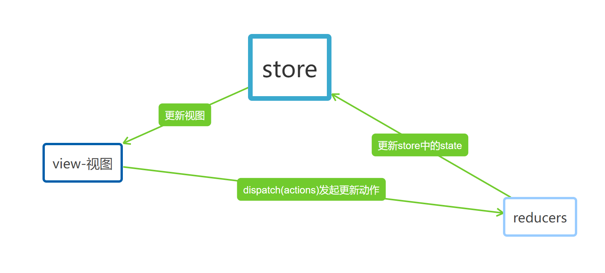

## Redux、redux-actions、redux-logger、redux-saga、react-redux、Redux Toolkit

### Redux
React中的问题：在React中，整个React没有数据向上回溯的能力，这就是React的单向数据流。这意味着如果一个数据状态复杂的应用，React可能根本无法让两个组件互相传递数据。
React问题解决：Redux就是把所有的state集中到组件顶部，能够灵活的将所有state中的各种数据分发给所有组件。
#### Redux的介绍
1. Redux给React应用提供可预测的状态管理机制。
2. Redux将数据存储到store里面。
3. store里面保存了一棵状态树state tree
4. 如果组件里面想要改变state，只能通过调用store的dispatch方法，触发一个action，这个action被对应的reducer处理，于是state完成更新。
5. 组件调用store的dispatch给store，而不是直接通知其他组件。
6. 其他组件可以通过订阅store的state，当state改变后更新自己的视图。
#### Redux代码
我们以下代码在React+TypeScrtip脚手架中执行。可以通过下面的命令创建脚手架
```
npx create-react-app jira --template typescript
```
> src/store/index.ts文件中写如下代码创建全局的state
```
//npm i redux 安装redux
import { createStore } from 'redux' //引入
type Type = 'Add' | 'Sub';
//创建reducers
const reducers = (state = {count: 0}, action:{type: Type}) => {
  switch(action.type){
    case 'Add': return {count: state.count + 1};
    case 'Sub': return {count: state.count - 1};
  }
}
//创建actions
export const actions:{
  add:()=>{type:'Add'}
  sub:()=>{type:'Sub'}
} = {
  add: () => ({type: 'Add'}),
  sub: () => ({type: 'Sub'})
}
//创建store
export const store = createStore(reducers);
```
> APP.tsx文件中执行如下代码 控制台输出结果是{count: 1}
```
import { store, actions } from './store';//引入store和actios
//使用store中的dispatch触发actions，让actions被对应的reducer调用
store.dispatch(actions.add());
//调用getState方法获取state的值
```
说明我们已经改变了全局store里面的值，并获取到了改变后的值。
#### Redux中actions的问题
我们看过上面的代码会发现，如果我们不写actions对象，直接调用store.dispatch({type: 'Add'});也会得到同样的效果，但是这样就使代码的维护更加复杂。
Redux中的流程图如下图所示

#### Redux中的不可变性
什么是不可变性呢？我们看以下的例子。
我创建一个对象和数组，我可以通过访问对象和数组来改变其中的值。
```
const obj = { a: 1, b: 2 }
obj.b = 3//对象仍然还是那个对象，但它的内容已经变了
const arr = ['a', 'b']
arr[1] = 'd'//数组仍然还是那个数组，但它的内容已经变了
```
这是数组和对象的可变性。
但是在Redux中我们要求不可变性。我们就需要先复制原来的对象or数组，然后更新复制体。这里又涉及到了浅拷贝和深拷贝。
浅拷贝就是拷贝了地址值，让拷贝体指向本体的地址，这样拷贝体仍然是本体。显然我们要使用的是深拷贝。我们可以使用js中的展开运算符，和数组的concat方法或slice方法。
1. 对于js中的展开运算符只是深拷贝了对象或数组的第一层，所以如果我们想要修改深层的对象，我们需要对每一层都使用展开运算符。
2. concat是深拷贝数组。
```
const obj = {
  a: {
    // 为了安全的更新 obj.a.c，需要先复制一份
    c: 3
  },
  b: 2
}
const obj2 = {
  // obj 的备份
  ...obj,
  // 覆盖 a
  a: {
    // obj.a 的备份
    ...obj.a,
    // 覆盖 c
    c: 42
  }
}
const arr = ['a', 'b'];
const arr2 = arr.concat('c');
const arr3 = arr.slice()
arr3.push('c')
```
#### redux-actions
```
npm i redux-actions
```
redux-actions让Redux状态管理更加简单，该库提供的createAction方法用于创建actions
```
import { createAction } from "redux-actions"
export const INCREMENT = 'INCREMENT'
export const increment = createAction(INCREMENT)
increment()//{ type: 'INCREMENT' }
increment(10)//{ type: 'INCREMENT', payload: 10 }
```
> 使用redux-actions修改src/store/index.ts文件代码
```
import { createStore } from 'redux' //引入
import { ActionFunctionAny, createAction } from 'redux-actions'
//创建reducers
export interface IAction{
  type: string,
  [index:string]:any
}
export interface IInitCountState{
  count: number
}
const reducers = (state = {count: 0}, action:IAction):IInitCountState => {
  switch(action.type){
    case 'Add': return {count: state.count + 1};
    case 'Sub': return {count: state.count - 1};
    default: 
      return {count: state.count};
  }
}
//创建actions
export const Add = 'Add';
export const add:ActionFunctionAny<{type: string}> = createAction(Add)
//创建store
export const store = createStore(reducers);
```
> 使用redux-actions修改APP.tsx文件中的代码 控制台输出结果是{count: 1}
```
import { store, add } from './store';//引入store和actios
//使用store中的dispatch触发actions，让actions被对应的reducer调用
store.dispatch(add());
//调用getState方法获取state的值
```
#### redux-logger
#### redux-saga
#### Redux中间件及异步操作
applyMiddleware
### react-redux
### react-router与Redux的结合
### Redux Toolkit
Redux Toolkit是Redux官方推荐的编写Redux逻辑的方法。


