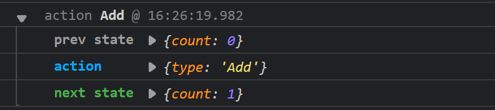
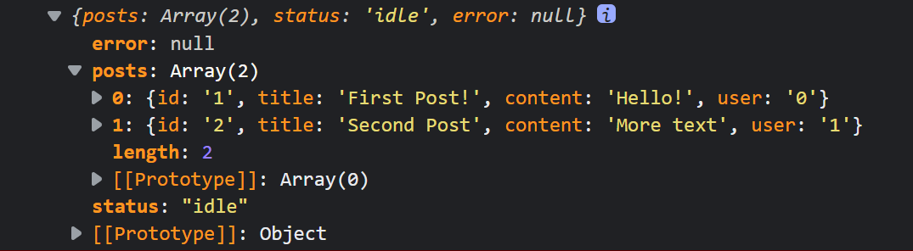
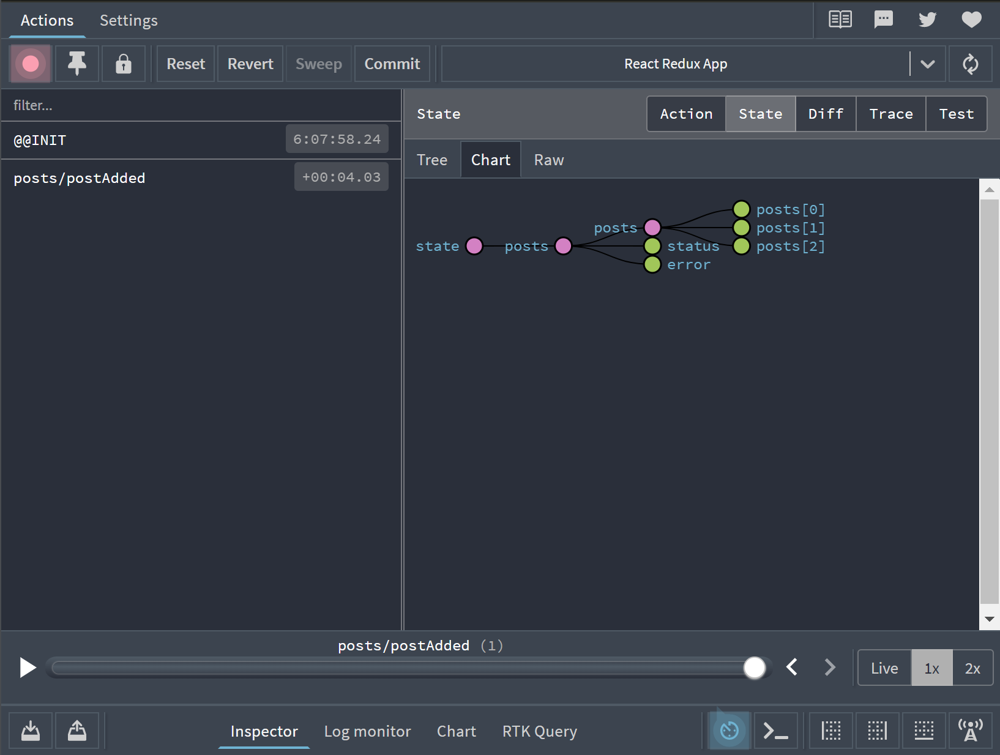

[Redux、Redux Toolkit](#1)
  + [Redux](#2)
    - [Redux的介绍](#3)
    - [Redux代码](#4)
    - [Redux中actions的问题](#5)
    - [Redux中的不可变性](#6)
    - [redux-actions](#7)
    - [Redux中间件及异步操作](#8)
  + [Redux Toolkit](#9)
    - [安装扩展](#10)
    - [store创建](#11)
    - [创建reducers](#12)
    - [绑定state](#13)
    - [获取state数据](#14)
    - [dispatch](#15)
    - [reducer中的prepare](#16)
    - [createAsynThunk异步调用](#17)

<p id=1></p>

## Redux、Redux Toolkit

<p id=2></p>

### Redux
React中的问题：在React中，整个React没有数据向上回溯的能力，这就是React的单向数据流。这意味着如果一个数据状态复杂的应用，React可能根本无法让两个组件互相传递数据。
React问题解决：Redux就是把所有的state集中到组件顶部，能够灵活的将所有state中的各种数据分发给所有组件。

<p id=3></p>

#### Redux的介绍
1. Redux给React应用提供可预测的状态管理机制。
2. Redux将数据存储到store里面。
3. store里面保存了一棵状态树state tree
4. 如果组件里面想要改变state，只能通过调用store的dispatch方法，触发一个action，这个action被对应的reducer处理，于是state完成更新。
5. 组件调用store的dispatch给store，而不是直接通知其他组件。
6. 其他组件可以通过订阅store的state，当state改变后更新自己的视图。

<p id=4></p>

#### Redux代码
我们以下代码在React+TypeScrtip脚手架中执行。可以通过下面的命令创建脚手架
```
npx create-react-app jira --template typescript
```
> src/store/index.ts文件中写如下代码创建全局的state
```ts
//npm i redux 安装redux
import { createStore } from 'redux' //引入
type Type = 'Add' | 'Sub';
//创建reducers
const reducers = (state = {count: 0}, action:{type: Type}) => {
  switch(action.type){
    case 'Add': return {count: state.count + 1};
    case 'Sub': return {count: state.count - 1};
  }
}
//创建actions
export const actions:{
  add:()=>{type:'Add'}
  sub:()=>{type:'Sub'}
} = {
  add: () => ({type: 'Add'}),
  sub: () => ({type: 'Sub'})
}
//创建store
export const store = createStore(reducers);
```
> APP.tsx文件中执行如下代码 控制台输出结果是{count: 1}
```tsx
import { store, actions } from './store';//引入store和actios
//使用store中的dispatch触发actions，让actions被对应的reducer调用
store.dispatch(actions.add());
//调用getState方法获取state的值
```
说明我们已经改变了全局store里面的值，并获取到了改变后的值。

<p id=5></p>

#### Redux中actions的问题
我们看过上面的代码会发现，如果我们不写actions对象，直接调用store.dispatch({type: 'Add'});也会得到同样的效果，但是这样就使代码的维护更加复杂。
Redux中的流程图如下图所示


<p id=6></p>

#### Redux中的不可变性
什么是不可变性呢？我们看以下的例子。
我创建一个对象和数组，我可以通过访问对象和数组来改变其中的值。
```js
const obj = { a: 1, b: 2 }
obj.b = 3//对象仍然还是那个对象，但它的内容已经变了
const arr = ['a', 'b']
arr[1] = 'd'//数组仍然还是那个数组，但它的内容已经变了
```
这是数组和对象的可变性。
但是在Redux中我们要求不可变性。我们就需要先复制原来的对象or数组，然后更新复制体。这里又涉及到了浅拷贝和深拷贝。
浅拷贝就是拷贝了地址值，让拷贝体指向本体的地址，这样拷贝体仍然是本体。显然我们要使用的是深拷贝。我们可以使用js中的展开运算符，和数组的concat方法或slice方法。
1. 对于js中的展开运算符只是深拷贝了对象或数组的第一层，所以如果我们想要修改深层的对象，我们需要对每一层都使用展开运算符。
2. concat是深拷贝数组。
```js
const obj = {
  a: {
    // 为了安全的更新 obj.a.c，需要先复制一份
    c: 3
  },
  b: 2
}
const obj2 = {
  // obj 的备份
  ...obj,
  // 覆盖 a
  a: {
    // obj.a 的备份
    ...obj.a,
    // 覆盖 c
    c: 42
  }
}
const arr = ['a', 'b'];
const arr2 = arr.concat('c');
const arr3 = arr.slice()
arr3.push('c')
```

<p id=7></p>

#### redux-actions
```
npm i redux-actions
```
redux-actions让Redux状态管理更加简单，该库提供的createAction方法用于创建actions
```tsx
import { createAction } from "redux-actions"
export const INCREMENT = 'INCREMENT'
export const increment = createAction(INCREMENT)
increment()//{ type: 'INCREMENT' }
increment(10)//{ type: 'INCREMENT', payload: 10 }
```
> 使用redux-actions修改src/store/index.ts文件代码
```tsx
import { createStore } from 'redux' //引入
import { ActionFunctionAny, createAction } from 'redux-actions'
//创建reducers
export interface IAction{
  type: string,
  [index:string]:any
}
export interface IInitCountState{
  count: number
}
const reducers = (state = {count: 0}, action:IAction):IInitCountState => {
  switch(action.type){
    case 'Add': return {count: state.count + 1};
    case 'Sub': return {count: state.count - 1};
    default: 
      return {count: state.count};
  }
}
//创建actions
export const Add = 'Add';
export const add:ActionFunctionAny<{type: string}> = createAction(Add)
//创建store
export const store = createStore(reducers);
```
> 使用redux-actions修改APP.tsx文件中的代码 控制台输出结果是{count: 1}
```tsx
import { store, add } from './store';//引入store和actios
//使用store中的dispatch触发actions，让actions被对应的reducer调用
store.dispatch(add());
//调用getState方法获取state的值
```

<p id=8></p>

#### Redux中间件及异步操作
1. 对于redux而言，同步就是当视图发出action后，reducer立即计算出state，异步是指当action发出后，需要等待结果计算完成，也就是一段时间再执行reducer。
2. 同步通常再原生的redux工作流程中，而大多数场景更多需要异步操作，例如ajax请求后拿到数据后再进入reducer执行计算并对state进行更新。
3. Redux显然是不支持异步操作的，这就要用到中间件来处理这种业务了。中间件就是对store.dispatch方法进行拓展。
我们可以使用redux-logger来查看dispatch改变状态时打印出来的旧状态、当前触发的action和新状态。也可以使用redux-saga来调用异步接口
> 使用redux-actions修改src/store/index.ts文件代码
```tsx
import { createStore, applyMiddleware } from 'redux' //引入
import { ActionFunctionAny, createAction } from 'redux-actions'
import logger  from 'redux-logger'
import createSagaMiddleware from 'redux-saga';
const sagaMiddleware = createSagaMiddleware(); // 调用异步接口
//创建reducers
export interface IAction{
  type: string,
  [index:string]:any
}
export interface IInitCountState{
  count: number
}
const reducers = (state = {count: 0}, action:IAction):IInitCountState => {
  switch(action.type){
    case 'Add': return {count: state.count + 1};
    case 'Sub': return {count: state.count - 1};
    default: 
      return {count: state.count};
  }
}
//创建actions
export const Add = 'Add';
export const add:ActionFunctionAny<{type: string}> = createAction(Add)
let middleware = [logger, sagaMiddleware]
//创建store
export const store = createStore(
  reducers,
  applyMiddleware(...middleware)
);
```
redux-logger在控制台输出如下：


<p id=9></p>

### Redux Toolkit
Redux Toolkit是Redux官方推荐的编写Redux逻辑的方法。
学习Redux Toolkit推荐到[Redux官网](https://cn.redux.js.org/)看官网的教程

<p id=10></p>

#### 安装扩展
1. React DevTools
2. Redux DevTools Extension
可以在[extfans](https://www.extfans.com/)上搜索对应的扩展。

<p id=11></p>

#### store创建
> store/index.js
```tsx
import { configureStore } from '@reduxjs/toolkit'//引入toolkit
import postsReducer from '../features/posts/postSlice'//引入的reducer函数，在下面会介绍到
export default configureStore({
  reducer: {
    posts: postsReducer
  }
})
```
我们可以通过Redux DevTools Extension来查看state的结构


<p id=12></p>

#### 创建reducers
> features/posts/postSlice.js
```tsx
import { createSlice } from '@reduxjs/toolkit'
const initialState = {
  posts: [
    { title: 'First Post!' },
    { title: 'Second Post' }
  ],
  status: 'idle',
  error: null
}
const postsSlice = createSlice({
  name: 'posts',
  initialState,
  reducers: {
    postAdded(state, action){
      state.posts.push({ title: action.payload })
    }
  }
})
export default postsSlice.reducer
```

<p id=13></p>

#### 绑定state
> index.tsx
使用Provider标签将store绑定到全局
```tsx
import React from 'react'
import ReactDOM from 'react-dom'
import './index.css'
import { App } from './App'
import store from './app/store'
import { Provider } from 'react-redux'
// Wrap app rendering so we can wait for the mock API to initialize
async function start() {
  ReactDOM.render(
    <React.StrictMode>
      <Provider store={store}>
        <App />
      </Provider>
    </React.StrictMode>,
    document.getElementById('root')
  )
}
start()
```

<p id=14></p>

#### 获取state数据
> App.js
```tsx
import React from "react";
import { useSelector } from "react-redux";

export const App = () => {
  const posts = useSelector(state => state.posts);
  console.log(posts);
  return <div></div>
}
```
控制台可以看到输出的结果


<p id=15></p>

#### dispatch
> App.js
```tsx
import React from "react";
import { useDispatch, useSelector } from "react-redux";
import { postAdded } from "./features/posts/postSlice";

export const App = () => {
  const dispatch = useDispatch();
  const posts = useSelector(state => state.posts);
  const add = () => {
    dispatch(postAdded('three'));
    console.log(posts);
  }
  return <div onClick={add}>+</div>
}
```
当我们点击“+”的时候，Redux DevTools Extension左侧会输出**posts/postAdded**，右侧的state树会变化。


<p id=16></p>

#### reducer中的prepare
我们可以使用prepare来接收参数，将参数转换成一定形式再传递给reducer对应的函数。
我们可以将features/posts/postSlice.js使用prepare来修改。
> features/posts/postSlice.js
```tsx
import { createSlice } from '@reduxjs/toolkit'
const initialState = {
  posts: [
    { title: 'First Post!' },
    { title: 'Second Post' }
  ],
  status: 'idle',
  error: null
}
const postsSlice = createSlice({
  name: 'posts',
  initialState,
  reducers: {
    postAdded:{
      reducer(state, action) {
        state.posts.push(action.payload)
      },
      prepare(title){
        return {
          payload: {
            title,
            content: '我是内容'
          }
        }
      }
    },
  }
})
export const { postAdded } = postsSlice.actions
export default postsSlice.reducer
```

<p id=17></p>

#### createAsynThunk异步调用
> features/posts/postSlice.js
```tsx
import { createSlice, createAsyncThunk } from '@reduxjs/toolkit'
import axios from 'axios'
const initialState = {
  posts: [
    { title: 'First Post!' },
    { title: 'Second Post' }
  ],
  status: 'idle',
  error: null
}
export const fetchPosts = createAsyncThunk('posts/fetchPosts',async()=>{
  //这里写axios请求
  const response = await axios({
    url: 'https://github.com/search?q=1514-blog'
  })
  return response;
})
const postsSlice = createSlice({
  name: 'posts',
  initialState,
  reducers: {
    postAdded:{
      reducer(state, action) {
        state.posts.push(action.payload)
      },
      prepare(title){
        return {
          payload: {
            title,
            content: '我是内容'
          }
        }
      }
    },
  },
  extraReducers(builder){
    builder
    .addCase(fetchPosts.pending, (state, action) => {
      console.log('loading',state, action);
      state.status = 'loading';
    })
    .addCase(fetchPosts.fulfilled, (state, action) => {
      console.log('succeeded',state, action);
      state.status = 'succeeded';
      state.posts = state.posts.concat(action.payload);
    })
    .addCase(fetchPosts.rejected, (state, action) => {
      console.log('failed',state, action);
      state.status = 'failed';
      state.error = action.error.message;
    })
  }
})
export const { postAdded } = postsSlice.actions
export default postsSlice.reducer
```
> App.js
```tsx
import React from "react";
import { useDispatch, useSelector } from "react-redux";
import { postAdded, fetchPosts } from "./features/posts/postSlice";

export const App = () => {
  const dispatch = useDispatch();
  const posts = useSelector(state => state.posts);
  const add = () => {
    dispatch(postAdded('three'));
    dispatch(fetchPosts());
    console.log(posts);
  }
  return <div onClick={add}>+</div>
}
```
其中extraReducers还有另一种写法
> features/posts/postSlice.js
```tsx
import { createSlice, createAsyncThunk } from '@reduxjs/toolkit'
import axios from 'axios'
const initialState = {
  posts: [
    { title: 'First Post!' },
    { title: 'Second Post' }
  ],
  status: 'idle',
  error: null
}
export const fetchPosts = createAsyncThunk('posts/fetchPosts',async()=>{
  //这里写axios请求
  const response = await axios({
    url: 'https://github.com/search?q=1514-blog'
  })
  return response;
})
const postsSlice = createSlice({
  name: 'posts',
  initialState,
  reducers: {
    postAdded:{
      reducer(state, action) {
        state.posts.push(action.payload)
      },
      prepare(title){
        return {
          payload: {
            title,
            content: '我是内容'
          }
        }
      }
    },
  },
  extraReducers: {
    [fetchPosts.pending]: (state, action) => {
      console.log('loading',state, action);
      state.status = 'loading';
    },
    [fetchPosts.fulfilled]: (state, action) => {
      console.log('succeeded',state, action);
      state.status = 'succeeded';
      state.posts = state.posts.concat(action.payload);
    },
    [fetchPosts.rejected]: (state, action) => {
      console.log('failed',state, action);
      state.status = 'failed';
      state.error = action.error.message;
    }
  }
})
export const { postAdded } = postsSlice.actions
export default postsSlice.reducer
```

