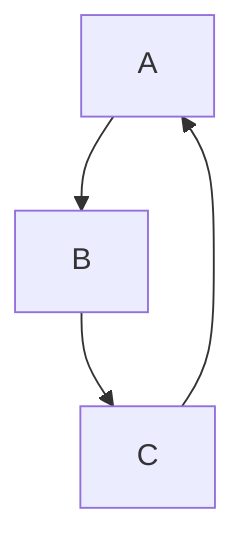

## 宏任务和微任务

### 宏任务
||浏览器|Node|
|:----:|:----:|:----:|
|I/O   |&#9745;|&#9745;|
|setTimeout|&#9745;|&#9745;|
|setInterval|&#9745;|&#9745;|
|setInnediate|&#9746;|&#9745;|
|requestAnimationFrame|&#9745;|&#9746;|

### 微任务
||浏览器|Node|
|:----:|:----:|:----:|
|process.nextTick|&#9746;|&#9745;|
|MutationObserver|&#9745;|&#9746;|
|Promise.then chat finally|&#9745;|&#9745;|

 
